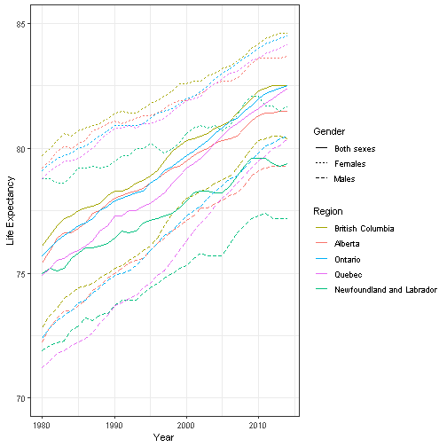

Developing Data Products Pitch For Course Project
========================================================
author: Christopher Stanwood 
date: 03-Oct-2018
autosize: true

Overview
========================================================
- This application shows the expected life expectancy at birth for most of the provinces of Canada
- It shows how the life expectancy has been steadily increasing since 1980
- It allows the user to select which regions to see, and whether to show results for men, women, or both together
- The results are displayed as a graph and a data table
- The data table uses linear regression to calculate the rate at which life expectancy has been changing, and to predict the life expectancy for 2018
- The data is from the Statistics Canada website: <https://www150.statcan.gc.ca/t1/tbl1/en/tv.action?pid=1310011401>  
- All the code can be seen here: <https://github.com/cstanwood/DevelopingDataProductsCourseProject> 
  


Create Plot
========================================================
  
In server.R create the plot using the checkboxes "input$Region" and "input$Gender" _(not all code shown due to space restrictions)_:
  
  ```r
  ggplot(data = filter(life_expectancy, GEO %in% input$Region & Sex %in% input$Gender), 
      aes(x = REF_DATE, y = VALUE, color = GEO, linetype = Sex)) + ...
  ```

***
  

Define Function
===
  Define a custom function to create a linear model for those provinces specified in the checkbox input: 
  
  ```r
  calcLm <- function(region) {
      model <- lm(VALUE ~ REF_DATE, data = filter(life_expectancy, GEO == region & 
          Sex == "Both sexes"))
      life_expect_2018 <- predict(model, newdata = data.frame(REF_DATE = 2018))
      return <- data.frame(Region = region, `Rate Of Change` = round(model$coefficients[2], 
          2), `Predicted Life Expectancy for 2018` = round(life_expect_2018, 2))
  }
  ```

Output Table
===
  _(Output is created with slightly different code than shown below, because of differences between shiny and R presenter)_

```r
mydataframe <- reactive({
    mylist <- lapply(input$Region, calcLm)
    do.call("rbind", mylist)
})
output$table <- renderDataTable(mydataframe())
```

<table>
 <thead>
  <tr>
   <th style="text-align:left;"> Region </th>
   <th style="text-align:right;"> Rate.Of.Change </th>
   <th style="text-align:right;"> Predicted.Life.Expectancy.for.2018 </th>
  </tr>
 </thead>
<tbody>
  <tr>
   <td style="text-align:left;"> British Columbia </td>
   <td style="text-align:right;"> 0.19 </td>
   <td style="text-align:right;"> 83.51 </td>
  </tr>
  <tr>
   <td style="text-align:left;"> Alberta </td>
   <td style="text-align:right;"> 0.17 </td>
   <td style="text-align:right;"> 82.54 </td>
  </tr>
  <tr>
   <td style="text-align:left;"> Ontario </td>
   <td style="text-align:right;"> 0.20 </td>
   <td style="text-align:right;"> 83.41 </td>
  </tr>
  <tr>
   <td style="text-align:left;"> Quebec </td>
   <td style="text-align:right;"> 0.22 </td>
   <td style="text-align:right;"> 83.28 </td>
  </tr>
  <tr>
   <td style="text-align:left;"> Newfoundland and Labrador </td>
   <td style="text-align:right;"> 0.14 </td>
   <td style="text-align:right;"> 80.38 </td>
  </tr>
</tbody>
</table>
